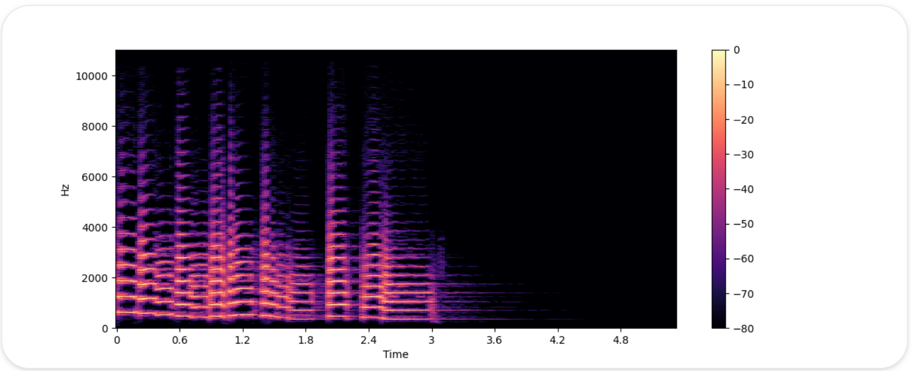

# Introduction to Audio Data

A sound wave is a continuous signal containing an ```infinite``` number of signal values in a given time. However, digital devices expect a ```finite array``` of values. Therefore, the countinuous sound wave needs to be converted into a ```series of discrete values known as a digital representation``` 
- storage and processing limitations

Different audio formats
- .wav (Waveform Audio File)
- .flac (Free Lossless Audio Codec)
- .mp3 (MPEG-1 Audio Layer 3)
These formats mainly differ in how they ```compress```` the digital 

## High Level View

1. Analog signal is captured by a microphone, which converts the sound waves into an electrical signal

2. Electrical signal is then digitized by an Analog-to-Digital Converter to get the digital representation through sampling

## Sampling and sampling rate

Sampling: Measuring the value of a continuous signal ```at fixed time steps```. Example: time step 0, time step 1, ..., time step i, time step 4 in the image below

The resulting sampled waveform is therefore ```discrete```: It contains a finite number of signal values at uniform intervals


Sampling Rate/Sampling Frequency: Number of samples (one data point) taken in 1 second. Measured in hertz (Hz). 
- When we digitize sound, we need to capture enough information to accurately represent the original continuous sound wave
- Taking many samples allows us to capture the shape and details of the sound wave over time. The more samples we take per second, the more accurate our digital representation of the sound will be

Nyquist Limit: The highest sound frequency that can be captured from the signal is exactly half the sampling rate 
- The audible frequencies in human speech are below 8 kHz and therefore sampling speech at 16 kHz is sufficient. 
- Using a higher sampling rate will not capture more information and merely leads to an increase in the computational cost of processing such files
- Sampling audio at too low a sampling rate will result in information loss. Speech sampled at 8 kHz will sound muffled, as the higher frequencies cannot be captured at this rate

### Consistent Sampling Rate

All audio examples in the dataset should have the same sampling rate when working on any audio task. For example, if you plan to use custom audio data to fine-tune a pre-trained model, the sampling rate of your data should match the sampling rate of the data the model was pre-trained on

Calculation example:
A 5-second sound at a sampling rate of 16,000 Hz will be represented as a series of 80,000 values, 
- 16 000 samples/second * 5 seconds

while the same 5-second sound at a sampling rate of 8,000 Hz will be represented as a series of 40,000 values
- 8 000 samples/second * 5 seconds

Transformer models that solve audio tasks treat examples as sequences and rely on attention mechanisms to learn audio or multimodal representation. Since sequences are different for audio examples at different sampling rates, it will be challenging for models to generalize between sampling rates. ```Resampling``` is the process of making the sampling rates match, and is part of preprocessing the audio data

## Amplitude and Bit Depth

While the ```sampling rate tells you how often the samples are taken```, ```what exactly are the values in each sample?```

```Amplitude```: Sound is made by changes in air pressure that happen at frequencies audible to humans.The ```amplitude``` of a sound describes the sound pressure level at any given instant and is measured in decibels (dB)
- We perceive the amplitude as loudness
- A normal speaking voice is under 60 dB, and a rock concert can be at around 125 dB

```Bit depth```: In digital audio, ```each audio sample records the amplitude of the audio wave at a point in time```. The ```bit depth``` of the sample determines the precision of the amplitude measured
- The higher the bit depth, the more faithfully the digital representation approximates the original continuous sound wave
- Refers to the number of bits used to represent each audio sample 

The ```most common audio bit depths``` are 16-bit and 24-bit
- Each is a binary term, representing the number of possible steps to which the amplitude value can be quantized (rounding the continuous amplitude value to the nearest step) when it’s converted from continuous to discrete: 
  - 65,536 steps for 16-bit audio
  - 16,777,216 steps for 24-bit audio
  - 16-bit has 65,536 possible values, so 65,536 possible amplitude values/levels of loudness 

Because quantizing involves rounding off the continuous value to a discrete value, the sampling process introduces noise. The higher the bit depth, the smaller this quantization noise - more amplitude levels means a lower rounding error, leading to a more accurate representation and lower background noise in the recording
- When converting from a continuous signal to a digital one, we can't always match the exact value of the original sound wave because we're limited to a finite number of steps (as calculated above). This mismatch between the actual value and the closest available value is called quantization noise
- In practice, the quantization noise of 16-bit audio is already small enough to be inaudible, and using higher bit depths is generally not necessary

32-bit audio: Stores the samples as floating-point values unlike 16-bit and 24-bit audio that uses interger samples. The precision of a 32-bit floating-point value is 24 bits, giving it the same bit depth as 24-bit audio. Floating-point audio samples are expected to lie within the [-1.0, 1.0] range. 

Note: Since machine learning models naturally work on floating-point data, the audio must first be converted into floating-point format before it can be used to train the model. 

The amplitude of digital audio is expressed in ```decibels (db)```. For digital audio signals, 0 dB is the loudest possible amplitude, while all other amplitudes are negative. As a quick rule of thumb: every -6 dB is a halving of the amplitude, and anything below -60 dB is generally inaudible unless you really crank up the volume 

## Audio as a Waveform (Time Domain Representation)

Sounds can be visualised as a waveform: Plot the sample values over time and illustrates the changes in the sound's amplitude
- Useful for identifying specific features of the audio signal such as the timing of individual sound events, the overall loudness of the signal, and any irregularities or noise present in the audio


This plots the amplitude of the signal on the y-axis and time along the x-axis. In other words, each point corresponds to a single sample value that was taken when this sound was sampled. Also note that librosa returns the audio as floating-point values already, and that the amplitude values are indeed within the [-1.0, 1.0] range.

Visualizing the audio along with listening to it can be a useful tool for understanding the data you are working with. You can see the shape of the signal, observe patterns, learn to spot noise or distortion. If you preprocess data in some ways, such as normalization, resampling, or filtering, you can visually confirm that preprocessing steps have been applied as expected. After training a model, you can also visualize samples where errors occur (e.g. in audio classification task) to debug the issue.

## Visualise Audio Data by Plotting the Frequency Spectrum of an Audio Signal (Frequency Domain Representation)

We can visualise audio data by plotting the frequency spectrum of the audio signal. The spectrum is computed using the Discrete Fourier Transform (DFT)
- Describes the ```individual frequencies that make up the signal``` and ```how strong they are```
- DFT is used to analyse and understand the different frequency components present in a signal
- DFT takes a signal and breaks it down into its individual frequency components. It tells you what frequencies are present in the signal and how strong each of those frequencies is.
- DFT input: A sequence of numbers representing a digital signal (like a snippet of an audio recording)
- DFT process: The DFT processes these numbers to find out which frequencies are present and how strong they are
- DFT Output: A list of frequencies and their corresponding strengths (amplitudes)


Frequency Spectrum for a small region for a trumpet sound. The DFT is taken over the first 4096 samples 

Plots the strength of the various frequency components that are present in this audio segment. The frequency values are on the x-axis, usually plotted on a logarithmic scale, while their amplitudes are on the y-axis.

The amplitude of each frequency component in the DFT output represents the strength or contribution of that frequency across the entire set samples 
- how much of that particular frequency is present in the entire signal

The waveform plots the amplitude of the audio signal over time, the spectrum visualizes the amplitudes of the individual frequencies at a fixed point in time.

## Spectrogram

The spectrum only shows a frozen snapshot of the frequencies in a given instant. If we want to ```see how the frequencies in an audio signal change```, we can take multiple DFTs each covering a small slice of time and stack the resulting spectra together into a spectrogram 
- A spectrogram plots the frequency content of an audio signal as it changes over time. It allows you to see time, frequency, and amplitude all on one graph
- The algorithm that performs this computation is the Short Time Fourier Transform (STFT)

Real life use case
- When working with a music recording, you can see the various instruments and vocal tracks and how they contribute to the overall sound
- In speech, you can identify different vowel sounds as each vowel is characterized by particular frequencies



- X-axis represents time as in the waveform visualization 
  - As you move from left to right, you're looking at how the signal evolves over time
- Y-axis represents frequency in Hz. The intensity of the color gives the amplitude or power of the frequency component at each point in time, measured in decibels (dB)
  - Shows the different frequencies present in the signal. Lower frequencies are at the bottom, and higher frequencies are at the top. The color intensity on the spectrogram represents the amplitude or power of the frequency components at each point in time, measured in decibels (dB)

Time Progression: You can see how the frequencies present in the signal change over time. For example, if a certain frequency band (a horizontal stripe) becomes brighter, it means that frequency has become louder at that moment.

Frequency Range: The y-axis shows that this spectrogram covers frequencies from 0 Hz (bottom) up to about 10,000 Hz (top). This range includes the most critical frequencies for human hearing, especially in speech and music.

Amplitude Changes: The varying color intensities reflect changes in the loudness of different frequencies over time. A strong, consistent color band across the spectrogram indicates a sustained tone or note, while more sporadic colors indicate transient or brief sounds.

### Calculation of Spectrum

The spectrogram is created by taking short segments of the audio signal, typically lasting a few milliseconds, and calculating the Discrete Fourier Transform of each segment to obtain its frequency spectrum. The resulting spectra are then stacked together on the time axis to create the spectrogram. 

Each vertical slice in this image corresponds to a single frequency spectrum
- By default, ```librosa.stft()``` splits the audio signal into segments of 2048 samples, which gives a good trade-off between frequency resolution and time resolution.

## Mel Spectrogram

A Mel Spectrogram is a special type of spectrogram. The only difference is that the Y-axis now uses the mel scale (different frequency axis but still shows the frequency content of an audio signal over time). The mel scale is used as it matches the way humans perceive pitch where it expands/spaces out lower frequencies (which we are more sensitive to) and compresses higher frequencies (which we are less sensitive to). In this manner, mel spectrogram emphasises the frequencies more relevant to human hearing. It provides a more human-centric view of audio data.

To generate a mel spectrogram, we start by performing the Short-Time Fourier Transform (STFT), just as we would for a standard spectrogram. The STFT splits the audio signal into short segments, each providing a frequency spectrum.

Then, each frequency spectrum is passed through a mel filterbank, a series of filters that convert the linear frequency scale (frequenices) into the mel scale. This transformation adjusts the frequency representation to reflect the human ear's sensitivity more accurately


Just as with a regular spectrogram, it’s common practice to express the strength of the mel frequency components in decibels. This is commonly referred to as a log-mel spectrogram, because the conversion to decibels involves a logarithmic operation

Compared to a standard spectrogram, a mel spectrogram can capture more meaningful features of the audio signal for human perception, making it a popular choice in tasks such as speech recognition, speaker identification, and music genre classification